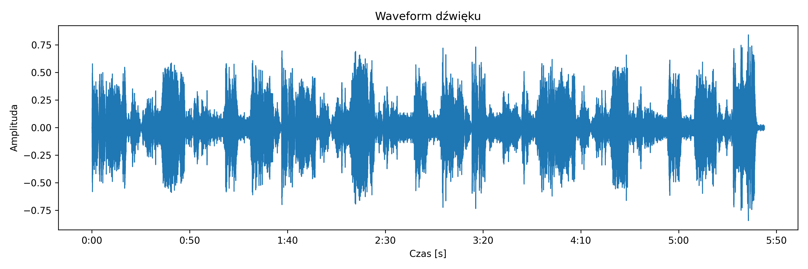
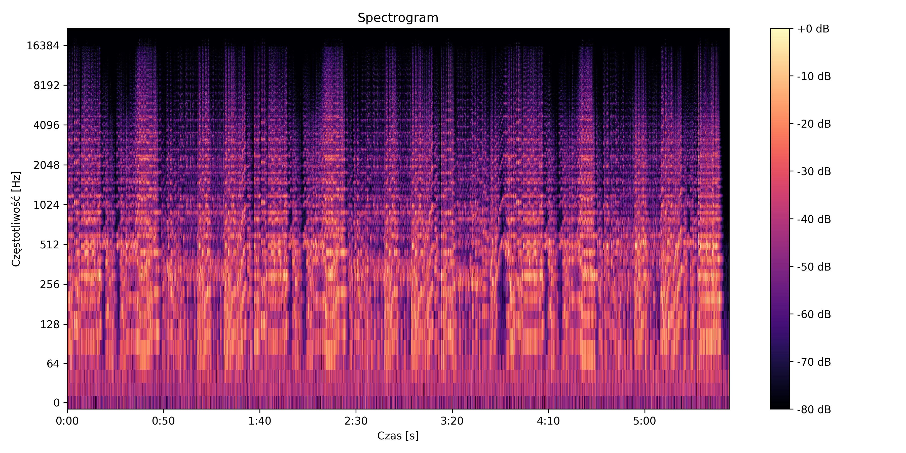

# 🎵 Sound Visualization Project

Projekt służy do wizualizacji plików audio przy użyciu bibliotek librosa i matplotlib.

## ✨ Funkcje programu

Program:

* wczytuje plik audio MP3
* generuje waveform (kształt fali)
* generuje spectrogram
* zapisuje wykresy do plików PNG
* wyświetla prostą animację ładowania w terminalu podczas przetwarzania
* wykorzystuje wielowątkowość do równoczesnego generowania spinnera i przetwarzania audio
* obsługuje błąd braku pliku audio

---

## ⚙️ Wymagania

Do uruchomienia projektu potrzebny jest Python 3.10+ oraz następujące biblioteki:

```bash
pip install librosa matplotlib numpy soundfile audioread
```

---

## 📁 Struktura projektu

```text
sound_visualization_project/
│
├── main.py
├── Pufino_Thoughtful(freetouse.com).mp3
├── waveform.png
├── spectrogram.png
└── README.md
```
---
## ▶️ Jak uruchomić

1. Uruchom program:
```bash
python visualize_sound.py
```

2. Po uruchomieniu wpisz nazwę pliku:

```bash
Enter MP3 file name: np.C:\Users\NazwaUżytkownika\Music\muzyka.mp3
```

---

## 🔄 Działanie programu

Podczas działania programu w terminalu wyświetlana jest prosta animacja ładowania:

```text
Generating plots... /
```
---
## 📊 Przykładowy wynik


```text
Waveform przedstawia zmiany amplitudy dźwięku w czasie. Większe wychylenia oznaczają głośniejsze fragmenty utworu, a mniejsze cichsze partie.
```


```text
Spectrogram pokazuje rozkład częstotliwości w czasie. Jaśniejsze kolory oznaczają większą intensywność danej częstotliwości, natomiast ciemniejsze mniejszą. Niskie częstotliwości znajdują się na dole wykresu, a wysokie u góry.
```
---
Po zakończeniu generowania wykresów pojawia się komunikat:

```text
Done!
```

---

## 💾 Zapisywane pliki

Program automatycznie zapisuje wygenerowane wykresy jako:

* waveform.png
* spectrogram.png

---

## ❌ Obsługa błędów

### FileNotFoundError

Jeśli plik audio nie zostanie znaleziony:

```text
Error: audio file not found.
```

Program zatrzyma spinner, zakończy działanie i wyjdzie z programu.

---

## 🚀 Możliwe rozszerzenia projektu

* mel-spectrogram
* chromagram
* wykrywanie beatów
* MFCC
* animowane wykresy
* GUI w Tkinter
* obsługa wielu plików audio
* wybór pliku audio z poziomu użytkownika

## 👨‍💻 Autor

Dariusz Zerynger
